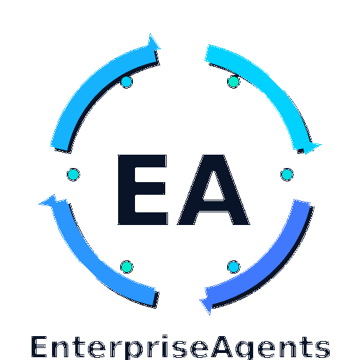

# Enterprise Agents

Enterprise Agents is an orchestration layer that turns a single instruction into a verified artifact bundle with an audit trail. It connects LLM providers such as OpenAI to a structured delivery workflow with planning, tool execution, review checks, policy decisions, and evidence records.

## Why the Verified Run System Matters

Large Language Models are useful for reasoning and drafting, but multi-step engineering work needs stronger controls. Common failure modes include drifting from the original plan, running unsafe commands, and producing work without objective proof of completion.

The **Verified Run System** adds that control layer. It uses an event-driven Kanban board to track workflow state, a central policy engine to gate tool calls, deterministic review checks, and JSONL audit records that make each run reproducible.

## Sprint 1: Local Verified Run

For Sprint 1, you can test the orchestration logic completely locally without any paid APIs using the deterministic local scaffold.

To begin working with the system, first create an isolated Python environment and install the package with development dependencies.

```bash
python -m venv .venv
source .venv/bin/activate
pip install -e ".[dev]"
```

Run a deterministic local execution:

```bash
enterpriseagents run "Scaffold a tiny Python CLI app with tests and a README" --workspace ./workspace --local
```

By default, policy-approved but higher-risk actions ask for human approval in the CLI. Use one of these flags when running in automation:

```bash
# Deny approval-required actions instead of prompting.
enterpriseagents run "Scaffold a tiny Python CLI app" --workspace ./workspace --local --non-interactive

# Approve approval-required actions without prompting.
enterpriseagents run "Scaffold a tiny Python CLI app" --workspace ./workspace --local --yes
```

### Expected Output Folder Structure

After running, the system guarantees the generation of both the workspace artifacts and the comprehensive run proof:

```text
workspace/
├── app.py
├── test_app.py
└── README.md

runs/<run_id>/
├── metadata.json
├── plan.json
├── task_graph.json
├── tool_calls.jsonl
├── policy_decisions.jsonl
├── test_results.txt
├── events.jsonl
├── tool_results.jsonl
└── evidence_packet.md
```

## System Architecture

The framework is composed of specialized agents that collaborate to achieve the user's goal.

- **Director Agent:** Analyzes the instruction and decomposes it into tasks with specific acceptance criteria.
- **Builder Agent:** Proposes concrete actions such as writing files or executing shell commands.
- **Reviewer Agent:** Runs verified checks against the work produced to ensure it meets the acceptance criteria.
- **Documentation Agent:** Generates comprehensive guides and usage instructions based on the actual artifacts produced.

Builder and documentation tool calls are evaluated by the central Policy Engine before execution. The policy blocks path traversal, sensitive file access, unknown tools, and dangerous shell commands. Allowed command and git actions can still require explicit approval before they run.

### Approval Modes

Enterprise Agents supports three approval modes:

- **Interactive CLI:** prompts before approval-required actions.
- **Non-interactive:** denies approval-required actions by default with `--non-interactive`.
- **Auto-approve:** approves approval-required actions with `--yes`.

Every policy decision and human approval decision is written to `policy_decisions.jsonl` in the run folder.

## Development and Testing

The project includes a comprehensive test suite that utilizes a mock language model. This allows developers to verify the internal logic and orchestration flow without incurring costs or requiring network access to external APIs.

To run the full test suite, execute the following command:

```bash
python -m pytest -q
```

We adhere to strict code quality standards. You can verify compliance by running the linting and type-checking tools.

```bash
python -m ruff check .
python -m mypy enterpriseagents
```

## What is Not Implemented Yet

- **Web Dashboard:** The React/TypeScript/Vite dashboard is planned but not started.
- **SQLite Storage:** Audit logs are currently written to local files, not SQLite.
- **Reviewer Policy Routing:** Builder and documentation tool calls go through the policy approval gate; reviewer checks currently execute through the tool registry directly.
- **Extensive Model Support:** Provider routing is structurally supported, but OpenAI is the primary integrated remote provider today.

## Licensing

This project is released under the MIT License. Please refer to the license file for full terms and conditions.
